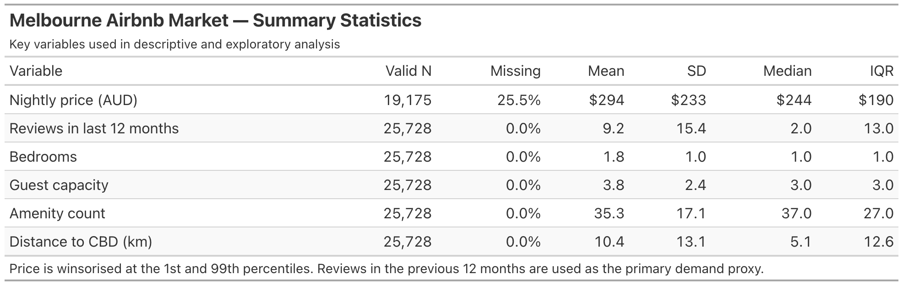
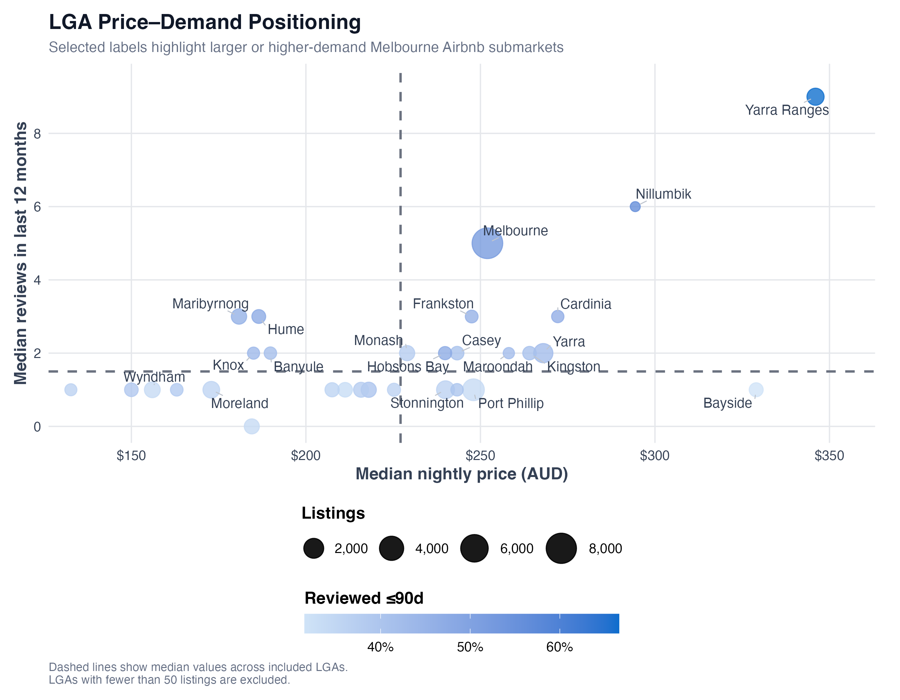
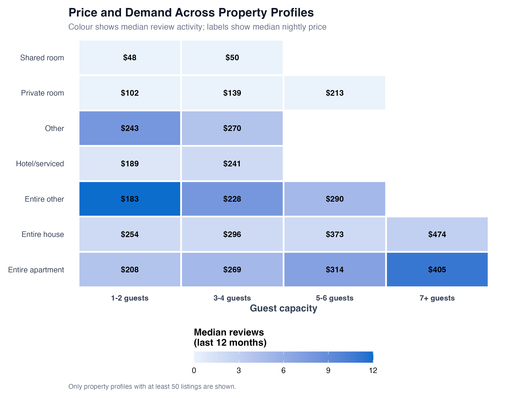
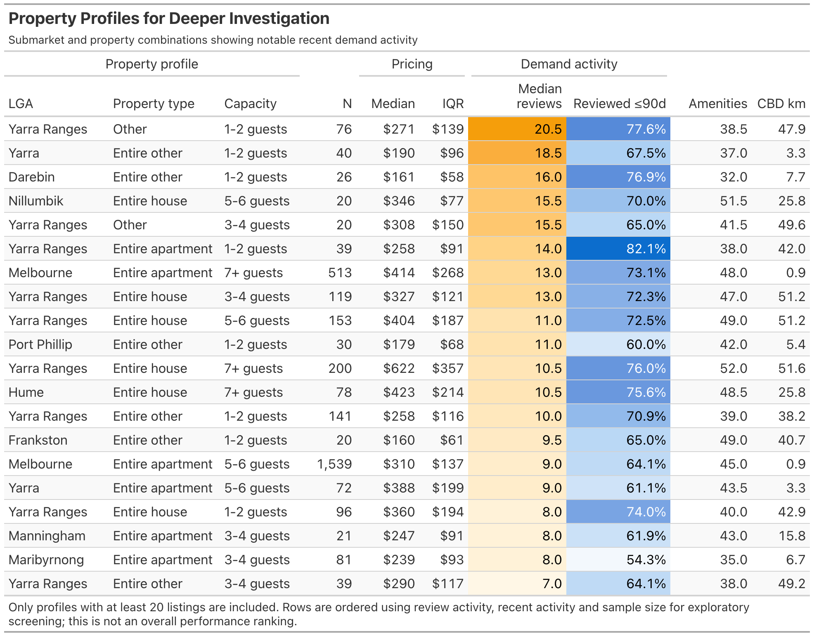

INTERIM REPORT

1. Introduction

Entering Melbourne's short-term rental market requires prospective Airbnb hosts to make two consequential decisions: which submarkets to target and what property configurations to operate. A poor choice made by the host is expensive and slow to reverse. Our clients are interested in listing multiple properties in Melbourne and require a report on which sub markets and property configurations are associated with stronger listing performance, rather than relying on intuition or agent review.

Our project uses the Inside Airbnb Melbourne dataset, based on a snapshot from 16 June 2026, covering 25,728 active listings across Greater Melbourne. It comprises three files: listings, attributes and pricing, along with 1.03 million guest reviews dating back to 2010 and 365 days of forward availability data. We selected this dataset because it captures property characteristics, host attributes, location, review activity and forward availability simultaneously which allows performance to be examined across the entire market rather than a sampled subset. 

Our goal is to identify which listing, host and location characteristics are associated with higher nightly prices and occupancy, and to translate those findings into a prioritised market-entry recommendation. The final report will present interpretable regression models alongside a predictive benchmark, supported with explicitly stated limitations.

2. Problem Definition and Objectives

Our client is a prospective multi-property host entering the Melbourne short-term rental market and must decide which submarket types and property types to prioritise. The business problem is that entry decisions are currently made on intuition alone, rather than being grounded in the observable characteristics that drive stronger performance. Because property acquisition is capital-intensive and difficult to reverse, quantifying these associations allows the client to allocate capital toward better-performing profiles and avoid submarkets with lower returns.

Research Question: What listing, host and location characteristics are associated with higher nightly price and occupancy for Melbourne Airbnb properties, and which submarket–property-type combinations offer the strongest entry opportunity for a prospective multi-property host?

The scope is intentionally cross-sectional. Interim feedback questioned whether seasonality, panel, and event-impact analyses were feasible given that the data comes from a single snapshot. On revisiting the plan, we confirmed they are not: predictors are observed only once, leaving no within-listing variation for a panel model, and the calendar file records availability but not price, meaning price seasonality cannot be computed at all.

We have therefore narrowed the analysis to four objectives: (i) modelling the drivers of nightly price; (ii) modelling occupancy using a calendar-derived measure independent of review activity; (iii) combining both into an expected-revenue comparison across submarkets; and (iv) benchmarking an interpretable regression model against a predictive model.

We hypothesise that CBD proximity, entire-home configurations, and superhost status are each positively associated with performance.

3. Data description 

The dataset is sourced from Inside Airbnb and captures a snapshot of Greater Melbourne taken on 16 June 2026. It comprises three files: listings (25,728 active listings from 14,113 hosts, across 90 variables), reviews (1,026,690 guest reviews dating back to 2010), and calendar (9.39 million rows of daily availability spanning 365 forward days). Key variables include nightly price, room and property type, capacity, amenities, coordinates, host attributes, and review scores.

Thirteen variables including host_since, host_response_rate, and instant_bookable were entirely empty in this snapshot and were removed, along with zero-variance and duplicate fields. Price required parsing from a currency string. Missing bathroom values were reduced from 8,158 to 23 by extracting numeric values from the bathrooms_text field; 82 property types were consolidated into seven categories, and coordinates were converted into distance from the CBD.

Three limitations are as follows. First, 25.5% of listings lack a price, and this missingness is non-random (33.4% for non-superhosts versus 7.4% for superhosts) so affected rows were flagged rather than deleted, to avoid systematically excluding weaker listings. Second, estimated_revenue_1365d is algebraically identical to price × occupancy, and estimated_occupancy_1365d is derived from review counts, making both unsuitable as dependent variables. Third, calendar availability cannot distinguish bookings from host-blocked dates.

Exploratory data analysis examined missingness patterns, price distributions (which were right-skewed, prompting a log transformation), and bivariate relationships. This revealed a correlation of 0.954 between distance to the CBD and distance to the coast, and a non-monotonic relationship between centrality and price.

4. Methodology and Analytical Approach

Method 1: Descriptive and exploratory analysis

The descriptive stage was used to identify the submarkets and property profiles that warrant deeper modelling. Summary statistics were calculated for nightly price, review activity, bedrooms, guest capacity, amenities and CBD distance, using both central tendency and dispersion. Since the supplied occupancy measure is mechanically derived from reviews, reviews in the last 12 months were used as the main investigated realised-demand proxy at this stage, alongside the share of listings reviewed within 90 days as an indicator of recent activity. Price was winsorised at the 1st and 99th percentile to reduce outlier influence.

Results were then grouped by LGA, property type and capacity. LGAs with fewer than 50 listings and property-profile combinations with fewer than 20 observations were excluded from screening to reduce instability from small samples. Boxplots, grouped tables, a price-demand LGA plot and a property-type/capacity heatmap were used to identify patterns rather than make causal claims to support closer investigation.

 Table 1:

Across the market, median nightly price was $244, compared with a mean of $294, confirming the right-skew in prices. Review activity was also strongly skewed, with a median of only 2 reviews compared with a mean of 9.2 over the previous year.

Figure 1:

Geographic screening showed substantial variation between LGAs: Yarra Ranges combined relatively high prices with high review activity, while Melbourne represented the largest market with comparatively strong demand. Bayside showed relatively high prices but weaker review activity.

Figure 2                                                                            

Figure 3

Property type also produced clear price differences, with entire houses generally priced above apartments and private/shared rooms. Combining property type and capacity further showed that demand and pricing vary substantially within broad property categories, supporting more detailed submarket–property analysis in the following stages.

Method 2: Cross-sectional regression
Two OLS regressions assess which listing characteristics are associated with nightly price and 90-day calendar unavailability, used as a proxy for demand pressure rather than confirmed occupancy. The price model uses log nightly price, allowing coefficients to be interpreted as percentage differences, while demand-model coefficients are interpreted as percentage-point differences.
Both models control for property type, capacity, bedrooms, bathrooms, amenities, superhost status, host scale, reviews, CBD distance and LGA. LGA indicators control for systematic geographic differences while CBD distance captures additional proximity effects. Missing review ratings for listings without reviews were mean-imputed alongside a separate has_reviews indicator. HC3 robust standard errors were used, and VIF diagnostics showed no serious multicollinearity. As the data are observational and cross-sectional, results are interpreted as associations rather than causal effects. 
Method 3: Market Segmentation / Property-Profile Comparison

Method 3 applies descriptive market segmentation to compare LGA × property profile × guest-capacity combinations using median listed nightly price, median reviews in the previous 12 months as a proxy for recent guest activity, and existing comparable listings as market supply. This approach directly supports market-entry evaluation by comparing like-for-like property profiles across LGAs. It assumes recent reviews reasonably reflect relative guest activity and that segment medians represent typical market conditions. Robustness will be assessed using alternative minimum sample thresholds and price missingness checks. Analysis is conducted in R, using data.table for reproducible aggregation and ggplot2 for visual comparison.

5. Analysis plan and Analysis Completed

Method 2: 
Both regressions have been estimated and diagnosed. The price model uses 19,156 observations and explains approximately 61% of price variation. Holding other factors constant, an additional bedroom is associated with 13.4% higher price, additional guest capacity with 5.6% higher price, and entire houses with 14.1% higher price.
The demand model produces different patterns. Entire houses are associated with approximately 3.5 percentage points higher calendar unavailability, while each additional kilometre from the CBD is associated with around a 0.30 percentage-point decrease. Review measures and several LGAs are also statistically significant.
Next, results from both models will be compared to identify characteristics associated with both pricing power and stronger demand signals, which will then inform the property-location comparisons in Method 3.

Method 3: 

Preliminary segmentation has been completed using the cleaned listings dataset. Segments with fewer than 20 listings or 20 observed prices were excluded, and candidate segments were identified where listed price and recent review activity were both above the median for the same property profile and capacity across LGAs. Initial results highlight several apartment/condo and house segments with comparatively favourable observed conditions. Remaining work includes sensitivity testing the screening thresholds, reviewing excluded or sparse property profiles, incorporating additional supporting market indicators where appropriate, and integrating method 3 findings with methods 1 and 2 before developing final market entry recommendations.

